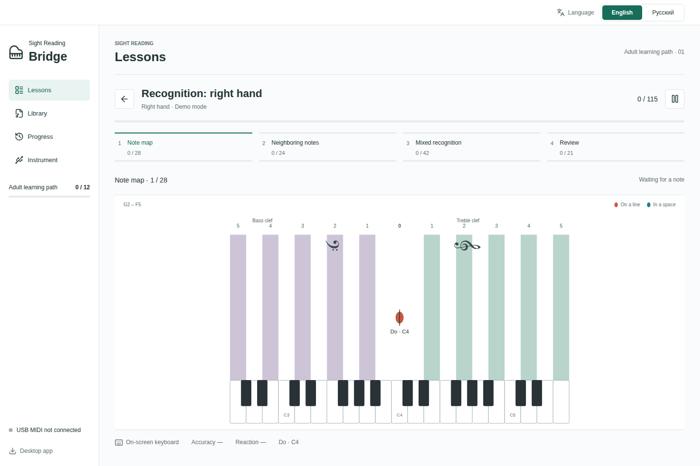
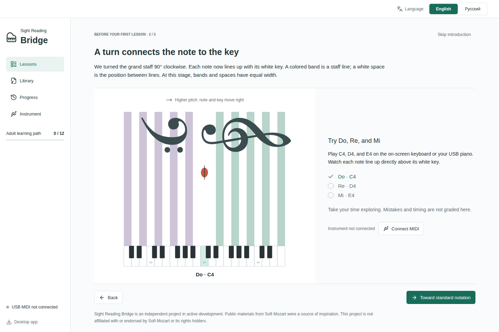
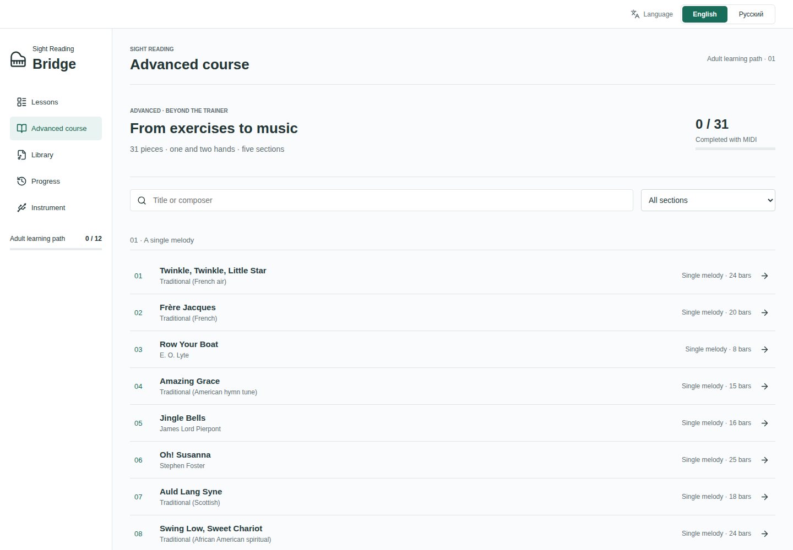

# Sight Reading Bridge

**From the keyboard to the score, one step at a time.**

[](https://github.com/nesfe/Sight-Reading-Bridge/actions/workflows/desktop-build.yml)
[](https://github.com/nesfe/Sight-Reading-Bridge/releases/latest)
[](https://github.com/nesfe/Sight-Reading-Bridge/releases/latest)
[](#connect-your-piano)
[](#project-status)

Sight Reading Bridge is an independent piano sight-reading trainer in active development. It makes the relationship between written notes and piano keys visible, then gradually withdraws that support. Play on your own digital piano, receive feedback locally, and keep the sound of your instrument.

**[Download for desktop](https://github.com/nesfe/Sight-Reading-Bridge/releases/latest)** · **[Русская документация](README.ru.md)**



*An English-language recognition lesson, shown in on-screen keyboard demo mode.*

The interface is available in **English and Russian**. The language selector stays visible at the top of every screen, including during practice. Your choice is saved on the device; the first visit follows your browser or system language, with English as the fallback.

## Why Turn the Staff?

On a conventional score, pitch rises **up the page**. On a piano, pitch rises **to the right**. A beginner must translate between these two directions while also finding a key and coordinating a hand.

Turning the grand staff **90° clockwise** aligns those directions: lower notes are on the left and higher notes on the right. In the introductory view, each natural note lines up with its white key. Colored bands represent actual staff lines; white spaces remain the positions between them. Giving bands and spaces equal width makes both kinds of position equally visible. Middle C connects the bass and treble regions and retains its short ledger line.

This is a temporary aid for reading notation. The route leads from vertical bands to horizontal bands and finally to a conventional staff. Labels, colors, and highlights can be reduced along the way. The goal is to read unfamiliar written music, including away from the app.

The first lesson includes an interactive introduction: turn the staff, try C4–D4–E4 on the screen or a USB piano, and compare the same pitch in all three views. It is ungraded, skippable, and can be reopened from the first lesson.



## Inspiration and Approach

[Soft Mozart's publicly available explanation of its teaching notation](https://www.softmozart.com/curriculum/eyenotes-sheet-music.html) was a source of inspiration during the project's design. It describes a visual connection between notes and keys, equal-width lines and spaces, and a gradual return to conventional notation. Our [design methodology](docs/source-methodology.md) sets out the learning goals and planned behavior of Sight Reading Bridge.

Sight Reading Bridge is not affiliated with, sponsored by, or endorsed by Soft Mozart or its rights holders. The name is used only to identify this reference, not to describe an official edition or a licensed implementation of its course. The current emphasis is an adult learning path, separate recognition and reading-ahead practice, USB-MIDI feedback, and local progress records. No equivalent or superior learning outcomes are claimed.

Reading a score combines pitch recognition, keyboard navigation, rhythm, and looking ahead. Sight Reading Bridge introduces these demands in stages, giving each skill room to develop.

| View | Visual support |
| --- | --- |
| **Vertical staff** | Note positions align with the keyboard. Staff bands and the spaces between them have equal width. |
| **Horizontal staff** | The same equal-width bands preserve familiar visual cues in the conventional reading direction. |
| **Standard notation** | A conventional grand staff, with visual support reduced as the learner progresses. |

Labels, color, staff width, and key highlights can be adjusted independently. Recognition exercises wait for a correct press and release; timed exercises introduce continuous reading and looking ahead. New attempts and repeated material are tracked separately.

## Practice With Purpose

- **A structured adult learning path.** Twelve lessons cover note recognition, melodic patterns, generated reading material, and reading ahead.
- **Complete note coverage.** Right-hand recognition includes 115 prompts; left-hand recognition includes 132. Every note in these lessons appears at least 15 times, across range practice, neighboring positions, shuffled sets, and a final check.
- **Progress you can inspect.** Review first-attempt accuracy, errors, and median reaction time for each note. Practice blocks include breaks, which are excluded from active practice time.
- **An Advanced repertoire course.** Thirty-one bundled pieces follow the trainer, from single melodies to two-hand piano music. Practice either hand or both, using vertical bands, horizontal bands, or a conventional score.
- **Your own sheet music.** Import MusicXML or compressed MXL, view a full score, select a part or staff, and follow it with MIDI pitch feedback, including chords and tied notes.
- **Local storage.** Lesson history and imported scores stay on your device. Export and import progress as JSON; manage scores in a local library. Web and desktop storage are separate.

## Get Started

### On Your Desktop

Download an installer from [GitHub Releases](https://github.com/nesfe/Sight-Reading-Bridge/releases/latest). No local compilation or developer tools are required.

| System | Download |
| --- | --- |
| macOS, Apple Silicon (M1 and later) | `mac-arm64.dmg` |
| macOS, Intel | `mac-x64.dmg` |
| Windows, x64 | `win-x64.exe` |
| Linux, x64 | `.AppImage`, `.deb`, or `.rpm` |

Starting with v0.6.1, macOS apps are ad-hoc signed and tested as native ARM64/Intel builds on macOS Sequoia. They are not Developer ID signed or notarized by Apple. macOS may require approval in System Settings → Privacy & Security → Open Anyway; see [Apple's guidance](https://support.apple.com/en-us/102445). Windows installers remain unsigned and SmartScreen may warn on first launch.

There is no public hosted demo. The browser interface remains in the repository for local development and self-hosting. To explore the desktop app without an instrument, enable the on-screen keyboard demo; demo attempts do not count toward course completion.

### Connect Your Piano

Starting an exercise opens a focused practice view with a larger score and keyboard. The top bar keeps manual fullscreen and language controls visible. Screen settings include a saved **Full screen when practice starts** switch, off by default. Leaving practice pauses without resetting your position. Fullscreen entered automatically ends with the exercise; manually entered fullscreen stays under your control.

Use your instrument's **USB-to-host** connection. Select its MIDI input in the app, then start a lesson. The intended setup uses wired USB MIDI; Bluetooth and microphone input are outside the current scope. Audio comes from your piano, with no software synthesizer in the app.

MIDI events are processed on your computer, without a server round trip for each note. The same lesson engine powers both versions. Diagnostic timing covers software event handling and the next animation frame; it is not a measurement of physical key-to-screen latency.

## Bring Your Own Scores

The library accepts MusicXML partwise files (`.musicxml`, `.xml`) and compressed MusicXML (`.mxl`). Files are parsed locally and rendered with OpenSheetMusicDisplay. Notation retains chords, accidentals, rests, durations, and ties.

Imported scores support horizontal bands and standard notation. MIDI following checks pitch, with part and staff selection. Rhythm, note-release timing, and pedal use are not graded in this mode, and results are not yet saved to course history. Repeats are not expanded and grace notes are skipped. Arbitrary imported scores do not yet have a vertical view.

PDF, MIDI files, MusicXML timewise, and native notation-editor formats are not supported. Export MusicXML partwise from your notation editor to use a score here. See the [detailed import notes](README.ru.md#импорт-партитур) for limits and notation-specific behavior.

## Advanced Repertoire



The **Advanced course** is a separate, freely accessible route after the trainer. Its 31 scores are bundled with the app and work offline in the desktop version. Five sections move from eight single-line melodies through first two-hand pieces, melody with accompaniment, and more demanding coordination. Composers include Türk, Beyer, Czerny, Petzold, Schumann, Burgmüller, and Tchaikovsky.

The main route is intended for the early years of piano study; it is not an accredited grade 1–3 syllabus. The last three pieces, by Satie, Chopin, and Bach, are **optional, harder challenges**. “Advanced” means a continuation of the trainer, not a professional playing level. Beethoven's *Ode to Joy* is a theme arrangement; *Für Elise* includes the A section. The eight single-line songs do not contain a written left-hand accompaniment.

All pieces support **vertical bands → horizontal bands → standard notation**. The vertical teaching window shows four upcoming score positions with durations, rests, accidentals and ties; natural-note positions share the keyboard's coordinates. Altered notes are written at their natural staff position with an accidental. The conventional score retains the edition's fuller engraving, including available fingering, dynamics and phrasing. The teaching window is not a facsimile of that engraving.

MIDI following waits for the required pitch or chord. It checks new attacks, not rhythm, releases, pedal or expression; repeats are not expanded and grace notes are skipped. Completed attempts are saved locally with hand, view, error count and demo status. Course credit requires a complete MIDI pass at 90% or better: right hand for a single-line melody, both hands for a piano piece. The score is attack groups divided by attack groups plus incorrect presses. Demo passes and separate-hand practice remain separate from whole-piece credit. These records are currently separate from the trainer's JSON progress export.

### Sources and Permissions

The MusicXML files come from the [open dacapo repertoire collection](https://github.com/ya-luotao/dacapo/tree/9d22701fb714ed6b3b4e8118f6337965bc54e1a9/scripts/pieces), pinned to an identified revision. Its documented licenses cover 28 MIT-licensed encodings and three CC0 encodings distributed through PDMX. Scores are redistributed unchanged; source editions, encoders and rights notices are preserved. Course ordering and translated display titles are our additions. This is attribution to the supplied sources, not a claim of independent musicological proofreading or universal legal clearance.

Each piece links to its source. [Repertoire notices](public/REPERTOIRE-NOTICES.txt), [full license texts](public/repertoire-licenses), and a [catalogue with SHA-256 hashes](packages/repertoire/catalog.json) accompany the collection. No recordings, artwork or application code from that project are included.

## Project Status

Sight Reading Bridge is in active development. The current release provides a working adult practice path; the full proposed curriculum is still being developed. Generated exercises are currently single-voice and use natural notes. Ear training, pedal assessment, and a complete rhythm curriculum are not yet included. The introduction animates the staff rotation; lesson presentation controls still switch views directly.

The project draws on the idea of gradually withdrawing visual support. Its practice thresholds are configurable training choices, not validated learning standards. The [methodology](docs/source-methodology.md) and [notation design notes](docs/notation-decisions.md), both in Russian, explain the rationale and distinguish the longer-term plan from the current implementation.

## Development

Built with **TypeScript, React, Vite, and Electron**, using **Web MIDI** for input, **VexFlow** for lesson notation, **OpenSheetMusicDisplay** for imported scores, and **IndexedDB** for local storage.

Node.js 24 is required for development. Desktop installers do not require Node.js.

```sh
npm ci
npm run dev
```

For browser-only local development, use `npm run dev:renderer`. The development server binds to loopback, not a public network interface. Chrome or Edge is required for the intended Web MIDI workflow. A remotely hosted browser build requires HTTPS.

| Directory | Purpose |
| --- | --- |
| `apps/web` | Shared React interface |
| `apps/desktop` | Electron window and isolated preload |
| `packages/music-core` | Pitch mapping and shared staff/keyboard geometry |
| `packages/notation-renderer` | Teaching views and conventional notation |
| `packages/midi-io` | MIDI input, connection handling, and diagnostics |
| `packages/i18n` | Bundled English/Russian messages and saved language selection |
| `packages/exercise-engine` | Reproducible exercise generation and session state |
| `packages/scoring-engine` | Performance metrics and support adjustment |
| `packages/curriculum` | Typed lessons and visual support settings |
| `packages/progress` | Local history and validated progress import |
| `packages/score-import` | MusicXML/MXL library and score following |
| `packages/repertoire` | Bundled licensed scores, course ordering and local repertoire records |

### Verification

```sh
npm run lint
npm test
npm run build
npx playwright install chromium
npm run test:e2e
```

Browser tests use simulated MIDI. On Linux, the Electron smoke test runs with `xvfb-run -a npm run test:desktop` and requires access to the system MIDI sequencer. Physical instrument latency requires a separate hardware measurement.

GitHub Actions runs checks on `main`. Version tags publish macOS arm64/x64, Windows x64, and Linux x64 installers, along with SHA-256 checksums. Each Mac build is tested on its native Sequoia runner: the DMG is verified, its app is copied out and signature-checked, then launched for architecture, MIDI, fullscreen and practice smoke tests. Third-party import notices are included in [IMPORT-NOTICES.txt](public/IMPORT-NOTICES.txt).

## Feedback

Use [GitHub Issues](https://github.com/nesfe/Sight-Reading-Bridge/issues) for bugs and suggestions. For a MIDI issue, include your operating system, browser or app version, instrument model, and the steps that reproduce it.
